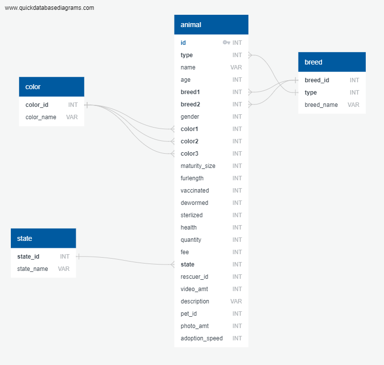

# Machine Learning Project_2 M2K (formerly known as The Data Condas)
### Mark Pasrich, Melissa Hazelgreen, and Kristin Aspromonti Submitted 10/15/2020

## Objective
To Positively influence adoption outcomes for animals that are least likely to be adopted.

# Background
Our mission is to help shelters and adoption agencies to compile their data in order to predict the probability of adoption for their animals. Those findings can be used with targeted marketing campaigns that will promote the animals with the lowest percentages. The ultimate goal is to positively influence adoption outcomes and reduce shelter life for these special needs animals.

 # Technologies

Resources
* Kaggle 
* Petfinder API

Dependencies
* Jupyter Notebook
* Pandas
* Tensorflow
* Sklearn
* SQLalchemy
* Flask
* OAuth2
* Requests
* Plotly
* Postgres

Languages
  * Javascript
  * HTML
  * SQL

# Objectives

1. Introducing the benefits of data and analytics to the process
2. Marketing strategies can be formulated around the dogs with the lowest scores.
3. Fostering initiatives implemented to maximize the likelihood of adoption
4. Manage shelter capacity

# Data Storage

# Training Data and Website Workflows

## Training Data Workflow
Using Kaggle dataset we are extracting the features and data of thousands of animals with a status of "adopted".
* Data is stored in a Postgres Database.
* Data is called from the database and fed into a Neural Network Model. The model is generating a prediction on how likely the animal will be adopted in one of these given time frames:

Same Day Adoption
* 1 and 7 days (1st week)
* 8 and 30 days (1st month)
* 31 and 90 days (2nd & 3rd month)
* No adoption after 100 days of being listed
 

## Tool
Using the tool will enable shelter/agency employees to compile and store important data and features of each animal in their care. As they update the database with the adoption status and dates of adoption, this data will feed the model, therefore building a stronger, more accurate prediction tool over time. This information can be used to modify marketing strategies, coordinate fostering efforts, or predict the capacity of the shelter
 

# Machine Learning Models

## Features
### X Data (Features)
- Type — Type of animal (1 = Dog, 2 = Cat)
- Age — Age of pet when listed, in months
- Breed1 — Primary breed of pet
- Breed2 — Secondary breed of pet, if pet is of mixed breed 
- Gender — Gender of pet 
- Color1 — Primary color
- Color2 — Secondary color
- Color3 — Tertiary color
- Maturity Size — Size at maturity
- Fur Length — Fur length (short, medium, long, n/a)
- Vaccinated — Pet has been vaccinated 
- Dewormed — Pet has been dewormed 
- Sterilized — Pet has been spayed / neutered 
- Health — Condition (healthy, minor or serious injury, n/a)
- Fee — Adoption fee 
- Video Amt — Total uploaded videos
- Photo Amt — Total uploaded photos

### Y Data (Features)
- Adoption Speed — Categorical speed of adoption. Lower is faster. This is the value to predict. See below section for more info.

## Model Comparisons
### Models
* Neural Network
* Random Forest
* Multiple Linear Regressions
* KNN

* Neural Network scored the best.

# Future Roadmap and Enhancements

* Fully implement and predict from API Dataset
* Store form input data to feed to the model
* Update statuses via form to feed to the model
* Gain deeper understanding of attributes to adoption
* Enhanced web design and features

## GitHub Repo
https://github.com/mpasricha1/Petfinder-Project.git

